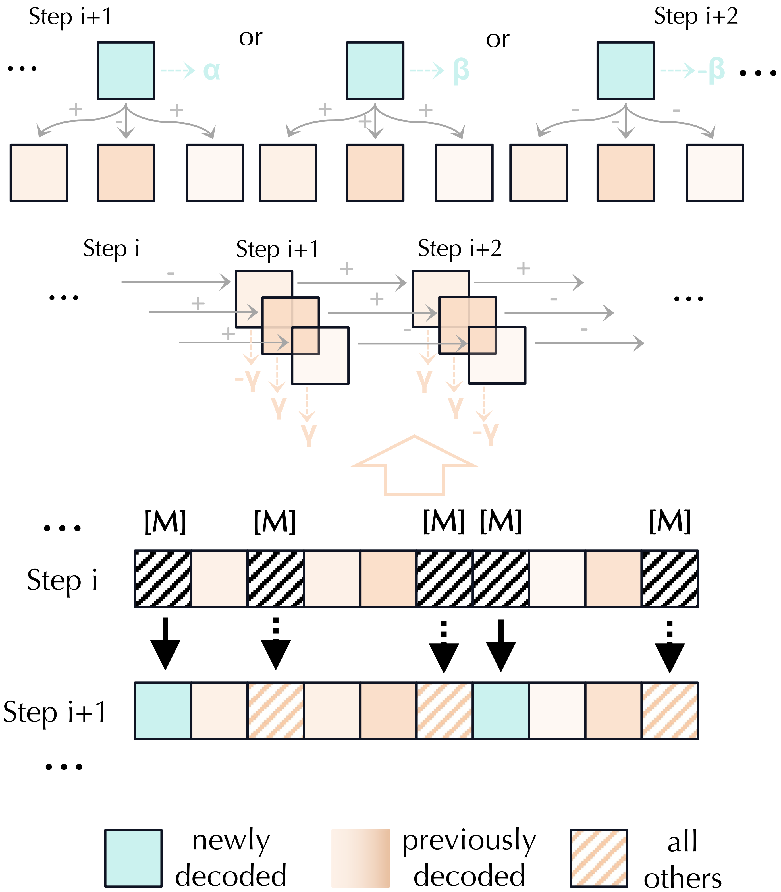
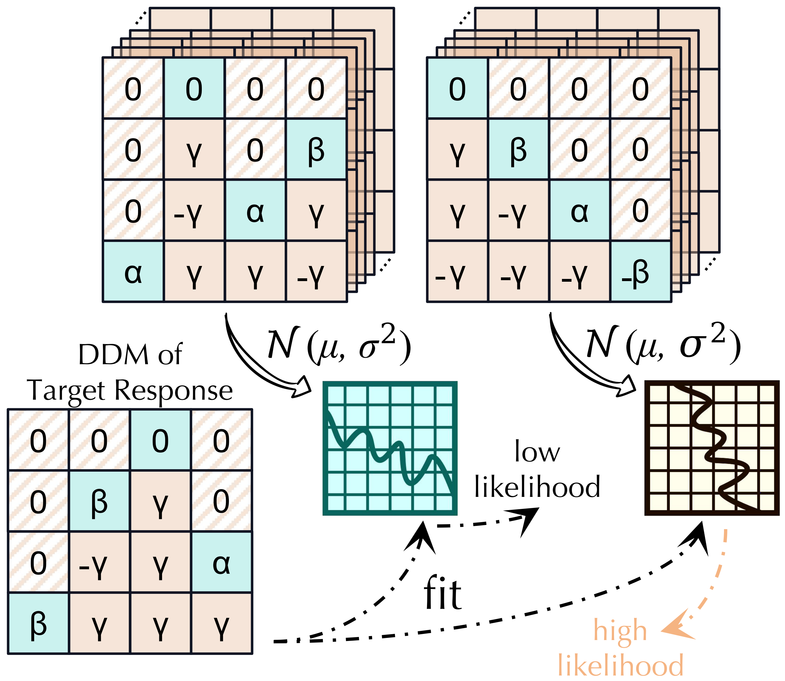

<div align="center">
    <h1>Every Step Counts: Decoding Trajectories as Authorship Fingerprints of dLLMs</h1>
    <p>The first model attribution pipeline tailored for dLLMs, fully leveraging their decoding trajectories.</p>
</div>

<table>
    <tr>
        <td align="center">
            
            <p><strong>Step 1.</strong> Use Directed Decoding Map (DDM) to capture structural and cross-step dependencies within the decoding trajectory of dLLMs.</p>
        </td>
        <td align="center">
            
            <p><strong>Step 2.</strong> Use Gaussian-Trajectory Attribution (GTA) to calculate the likelihood and attribute a specific response to its corresponding model. </p>
        </td>
    </tr>
</table>

<div align="center">
  <hr width="100%">
</div>


## Environment Setup

To setup the environment, run;
```
conda env create -f env.yml
conda activate dllmAtt
```


## SFT
We follow the SFT pipeline as reproduced in [d1’s repository](https://github.com/dllm-reasoning/d1). To perform SFT and save the checkpoint of a specific model under a specific dataset, run the following command:

```bash
# First go to the SFT directory
cd SFT

CUDA_VISIBLE_DEVICES=0,1,3,4,5,6,7 accelerate launch --config_file ddp_config.yaml --main_process_port 29500 --num_processes 8 sft_train.py
```

When changing the training dataset, make sure to update the data processing logic in both `sft_trainer.py` and `sft_train.py` accordingly. When using a different model, remember to adjust the corresponding `mask_token_id` in the training configuration to match the new model’s tokenizer.

## Metadata Collection

After training the candidate models required for the attribution task, run the following script to collect and save the metadata (e.g., `confidence`, `filtered_confidence`, `DDM`, etc.) for each model:

```bash
python main_metadataCollection.py --exp_name llada-sft-CodeAlpaca_20K-0.7 --ckpt_num 5000 --gen_length 32 --block_size 32 --mask_token_id 126336
```
where `--ckpt_num` is the checkpoint used to generate and save the metadata.

## Evaluation

The evaluation code is in `main_attribution.py`. Just run `python main_attribution.py` to evaluate the performance of different information-method combinations.


## Citation

If you find this work useful or interesting, please consider citing:

```bibtex
Coming soon.
```

